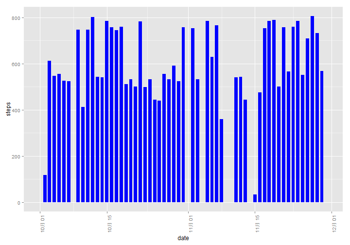
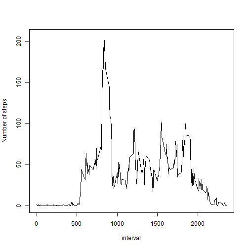
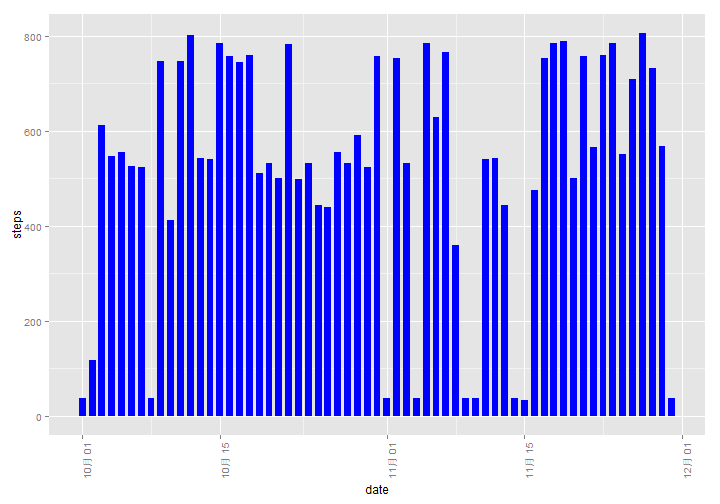
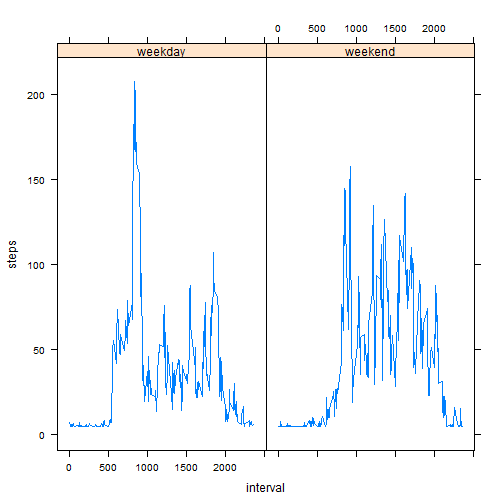

Reproducible Research Assignment1
===============================================
---
title: "Reproducible Research: Peer Assessment 1"
output: 
  html_document:
    keep_md: true
---
## Loading and preprocessing the data

## What is mean total number of steps taken per day?
### 1. a histogram of the total number of steps taken each day
 
### 2. Calculate and report the mean and median total number of steps taken per day

```
## data$date: 2012-10-01
##   mean median 
##    NaN     NA 
## -------------------------------------------------------- 
## data$date: 2012-10-02
##   mean median 
## 0.4375 0.0000 
## -------------------------------------------------------- 
## data$date: 2012-10-03
##   mean median 
##  39.42   0.00 
## -------------------------------------------------------- 
## data$date: 2012-10-04
##   mean median 
##  42.07   0.00 
## -------------------------------------------------------- 
## data$date: 2012-10-05
##   mean median 
##  46.16   0.00 
## -------------------------------------------------------- 
## data$date: 2012-10-06
##   mean median 
##  53.54   0.00 
## -------------------------------------------------------- 
## data$date: 2012-10-07
##   mean median 
##  38.25   0.00 
## -------------------------------------------------------- 
## data$date: 2012-10-08
##   mean median 
##    NaN     NA 
## -------------------------------------------------------- 
## data$date: 2012-10-09
##   mean median 
##  44.48   0.00 
## -------------------------------------------------------- 
## data$date: 2012-10-10
##   mean median 
##  34.38   0.00 
## -------------------------------------------------------- 
## data$date: 2012-10-11
##   mean median 
##  35.78   0.00 
## -------------------------------------------------------- 
## data$date: 2012-10-12
##   mean median 
##  60.35   0.00 
## -------------------------------------------------------- 
## data$date: 2012-10-13
##   mean median 
##  43.15   0.00 
## -------------------------------------------------------- 
## data$date: 2012-10-14
##   mean median 
##  52.42   0.00 
## -------------------------------------------------------- 
## data$date: 2012-10-15
##   mean median 
##   35.2    0.0 
## -------------------------------------------------------- 
## data$date: 2012-10-16
##   mean median 
##  52.38   0.00 
## -------------------------------------------------------- 
## data$date: 2012-10-17
##   mean median 
##  46.71   0.00 
## -------------------------------------------------------- 
## data$date: 2012-10-18
##   mean median 
##  34.92   0.00 
## -------------------------------------------------------- 
## data$date: 2012-10-19
##   mean median 
##  41.07   0.00 
## -------------------------------------------------------- 
## data$date: 2012-10-20
##   mean median 
##  36.09   0.00 
## -------------------------------------------------------- 
## data$date: 2012-10-21
##   mean median 
##  30.63   0.00 
## -------------------------------------------------------- 
## data$date: 2012-10-22
##   mean median 
##  46.74   0.00 
## -------------------------------------------------------- 
## data$date: 2012-10-23
##   mean median 
##  30.97   0.00 
## -------------------------------------------------------- 
## data$date: 2012-10-24
##   mean median 
##  29.01   0.00 
## -------------------------------------------------------- 
## data$date: 2012-10-25
##   mean median 
##  8.653  0.000 
## -------------------------------------------------------- 
## data$date: 2012-10-26
##   mean median 
##  23.53   0.00 
## -------------------------------------------------------- 
## data$date: 2012-10-27
##   mean median 
##  35.14   0.00 
## -------------------------------------------------------- 
## data$date: 2012-10-28
##   mean median 
##  39.78   0.00 
## -------------------------------------------------------- 
## data$date: 2012-10-29
##   mean median 
##  17.42   0.00 
## -------------------------------------------------------- 
## data$date: 2012-10-30
##   mean median 
##  34.09   0.00 
## -------------------------------------------------------- 
## data$date: 2012-10-31
##   mean median 
##  53.52   0.00 
## -------------------------------------------------------- 
## data$date: 2012-11-01
##   mean median 
##    NaN     NA 
## -------------------------------------------------------- 
## data$date: 2012-11-02
##   mean median 
##  36.81   0.00 
## -------------------------------------------------------- 
## data$date: 2012-11-03
##   mean median 
##   36.7    0.0 
## -------------------------------------------------------- 
## data$date: 2012-11-04
##   mean median 
##    NaN     NA 
## -------------------------------------------------------- 
## data$date: 2012-11-05
##   mean median 
##  36.25   0.00 
## -------------------------------------------------------- 
## data$date: 2012-11-06
##   mean median 
##  28.94   0.00 
## -------------------------------------------------------- 
## data$date: 2012-11-07
##   mean median 
##  44.73   0.00 
## -------------------------------------------------------- 
## data$date: 2012-11-08
##   mean median 
##  11.18   0.00 
## -------------------------------------------------------- 
## data$date: 2012-11-09
##   mean median 
##    NaN     NA 
## -------------------------------------------------------- 
## data$date: 2012-11-10
##   mean median 
##    NaN     NA 
## -------------------------------------------------------- 
## data$date: 2012-11-11
##   mean median 
##  43.78   0.00 
## -------------------------------------------------------- 
## data$date: 2012-11-12
##   mean median 
##  37.38   0.00 
## -------------------------------------------------------- 
## data$date: 2012-11-13
##   mean median 
##  25.47   0.00 
## -------------------------------------------------------- 
## data$date: 2012-11-14
##   mean median 
##    NaN     NA 
## -------------------------------------------------------- 
## data$date: 2012-11-15
##   mean median 
## 0.1424 0.0000 
## -------------------------------------------------------- 
## data$date: 2012-11-16
##   mean median 
##  18.89   0.00 
## -------------------------------------------------------- 
## data$date: 2012-11-17
##   mean median 
##  49.79   0.00 
## -------------------------------------------------------- 
## data$date: 2012-11-18
##   mean median 
##  52.47   0.00 
## -------------------------------------------------------- 
## data$date: 2012-11-19
##   mean median 
##   30.7    0.0 
## -------------------------------------------------------- 
## data$date: 2012-11-20
##   mean median 
##  15.53   0.00 
## -------------------------------------------------------- 
## data$date: 2012-11-21
##   mean median 
##   44.4    0.0 
## -------------------------------------------------------- 
## data$date: 2012-11-22
##   mean median 
##  70.93   0.00 
## -------------------------------------------------------- 
## data$date: 2012-11-23
##   mean median 
##  73.59   0.00 
## -------------------------------------------------------- 
## data$date: 2012-11-24
##   mean median 
##  50.27   0.00 
## -------------------------------------------------------- 
## data$date: 2012-11-25
##   mean median 
##  41.09   0.00 
## -------------------------------------------------------- 
## data$date: 2012-11-26
##   mean median 
##  38.76   0.00 
## -------------------------------------------------------- 
## data$date: 2012-11-27
##   mean median 
##  47.38   0.00 
## -------------------------------------------------------- 
## data$date: 2012-11-28
##   mean median 
##  35.36   0.00 
## -------------------------------------------------------- 
## data$date: 2012-11-29
##   mean median 
##  24.47   0.00 
## -------------------------------------------------------- 
## data$date: 2012-11-30
##   mean median 
##    NaN     NA
```
##  What is the average daily activity pattern?
###  1.Make a time series plot (i.e. type = "l") of the 5-minute interval (x-axis) and the average number of steps taken, averaged across all days (y-axis)

 
### 2.Which 5-minute interval, on average across all the days in the dataset, contains the maximum number of steps?

```
##    mean maximum 
##    1178    2355
```
##  Imputing missing values
###  1.Calculate and report the total number of missing values in the dataset (i.e. the total number of rows with NAs)
The total number of missing values: 2304
inte
###  2.Devise a strategy for filling in all of the missing values in the dataset.
Using the mean for that day for filling in all of the missing values
Find the the missing values locations

### 3.Create a new dataset that is equal to the original dataset but with the missing data filled in

###  4.Make a histogram of the total number of steps taken each day and Calculate and report the mean and median total number of steps taken per day. Do these values differ from the estimates from the first part of the assignment? What is the impact of imputing missing data on the estimates of the total daily number of steps?
#### The histogram of the total number of steps taken each day
 
#### The mean and median total number of steps taken per day

```
## newdata$date: 2012-10-01
##   mean median 
##  37.38  37.38 
## -------------------------------------------------------- 
## newdata$date: 2012-10-02
##   mean median 
## 0.4375 0.0000 
## -------------------------------------------------------- 
## newdata$date: 2012-10-03
##   mean median 
##  39.42   0.00 
## -------------------------------------------------------- 
## newdata$date: 2012-10-04
##   mean median 
##  42.07   0.00 
## -------------------------------------------------------- 
## newdata$date: 2012-10-05
##   mean median 
##  46.16   0.00 
## -------------------------------------------------------- 
## newdata$date: 2012-10-06
##   mean median 
##  53.54   0.00 
## -------------------------------------------------------- 
## newdata$date: 2012-10-07
##   mean median 
##  38.25   0.00 
## -------------------------------------------------------- 
## newdata$date: 2012-10-08
##   mean median 
##  37.38  37.38 
## -------------------------------------------------------- 
## newdata$date: 2012-10-09
##   mean median 
##  44.48   0.00 
## -------------------------------------------------------- 
## newdata$date: 2012-10-10
##   mean median 
##  34.38   0.00 
## -------------------------------------------------------- 
## newdata$date: 2012-10-11
##   mean median 
##  35.78   0.00 
## -------------------------------------------------------- 
## newdata$date: 2012-10-12
##   mean median 
##  60.35   0.00 
## -------------------------------------------------------- 
## newdata$date: 2012-10-13
##   mean median 
##  43.15   0.00 
## -------------------------------------------------------- 
## newdata$date: 2012-10-14
##   mean median 
##  52.42   0.00 
## -------------------------------------------------------- 
## newdata$date: 2012-10-15
##   mean median 
##   35.2    0.0 
## -------------------------------------------------------- 
## newdata$date: 2012-10-16
##   mean median 
##  52.38   0.00 
## -------------------------------------------------------- 
## newdata$date: 2012-10-17
##   mean median 
##  46.71   0.00 
## -------------------------------------------------------- 
## newdata$date: 2012-10-18
##   mean median 
##  34.92   0.00 
## -------------------------------------------------------- 
## newdata$date: 2012-10-19
##   mean median 
##  41.07   0.00 
## -------------------------------------------------------- 
## newdata$date: 2012-10-20
##   mean median 
##  36.09   0.00 
## -------------------------------------------------------- 
## newdata$date: 2012-10-21
##   mean median 
##  30.63   0.00 
## -------------------------------------------------------- 
## newdata$date: 2012-10-22
##   mean median 
##  46.74   0.00 
## -------------------------------------------------------- 
## newdata$date: 2012-10-23
##   mean median 
##  30.97   0.00 
## -------------------------------------------------------- 
## newdata$date: 2012-10-24
##   mean median 
##  29.01   0.00 
## -------------------------------------------------------- 
## newdata$date: 2012-10-25
##   mean median 
##  8.653  0.000 
## -------------------------------------------------------- 
## newdata$date: 2012-10-26
##   mean median 
##  23.53   0.00 
## -------------------------------------------------------- 
## newdata$date: 2012-10-27
##   mean median 
##  35.14   0.00 
## -------------------------------------------------------- 
## newdata$date: 2012-10-28
##   mean median 
##  39.78   0.00 
## -------------------------------------------------------- 
## newdata$date: 2012-10-29
##   mean median 
##  17.42   0.00 
## -------------------------------------------------------- 
## newdata$date: 2012-10-30
##   mean median 
##  34.09   0.00 
## -------------------------------------------------------- 
## newdata$date: 2012-10-31
##   mean median 
##  53.52   0.00 
## -------------------------------------------------------- 
## newdata$date: 2012-11-01
##   mean median 
##  37.38  37.38 
## -------------------------------------------------------- 
## newdata$date: 2012-11-02
##   mean median 
##  36.81   0.00 
## -------------------------------------------------------- 
## newdata$date: 2012-11-03
##   mean median 
##   36.7    0.0 
## -------------------------------------------------------- 
## newdata$date: 2012-11-04
##   mean median 
##  37.38  37.38 
## -------------------------------------------------------- 
## newdata$date: 2012-11-05
##   mean median 
##  36.25   0.00 
## -------------------------------------------------------- 
## newdata$date: 2012-11-06
##   mean median 
##  28.94   0.00 
## -------------------------------------------------------- 
## newdata$date: 2012-11-07
##   mean median 
##  44.73   0.00 
## -------------------------------------------------------- 
## newdata$date: 2012-11-08
##   mean median 
##  11.18   0.00 
## -------------------------------------------------------- 
## newdata$date: 2012-11-09
##   mean median 
##  37.38  37.38 
## -------------------------------------------------------- 
## newdata$date: 2012-11-10
##   mean median 
##  37.38  37.38 
## -------------------------------------------------------- 
## newdata$date: 2012-11-11
##   mean median 
##  43.78   0.00 
## -------------------------------------------------------- 
## newdata$date: 2012-11-12
##   mean median 
##  37.38   0.00 
## -------------------------------------------------------- 
## newdata$date: 2012-11-13
##   mean median 
##  25.47   0.00 
## -------------------------------------------------------- 
## newdata$date: 2012-11-14
##   mean median 
##  37.38  37.38 
## -------------------------------------------------------- 
## newdata$date: 2012-11-15
##   mean median 
## 0.1424 0.0000 
## -------------------------------------------------------- 
## newdata$date: 2012-11-16
##   mean median 
##  18.89   0.00 
## -------------------------------------------------------- 
## newdata$date: 2012-11-17
##   mean median 
##  49.79   0.00 
## -------------------------------------------------------- 
## newdata$date: 2012-11-18
##   mean median 
##  52.47   0.00 
## -------------------------------------------------------- 
## newdata$date: 2012-11-19
##   mean median 
##   30.7    0.0 
## -------------------------------------------------------- 
## newdata$date: 2012-11-20
##   mean median 
##  15.53   0.00 
## -------------------------------------------------------- 
## newdata$date: 2012-11-21
##   mean median 
##   44.4    0.0 
## -------------------------------------------------------- 
## newdata$date: 2012-11-22
##   mean median 
##  70.93   0.00 
## -------------------------------------------------------- 
## newdata$date: 2012-11-23
##   mean median 
##  73.59   0.00 
## -------------------------------------------------------- 
## newdata$date: 2012-11-24
##   mean median 
##  50.27   0.00 
## -------------------------------------------------------- 
## newdata$date: 2012-11-25
##   mean median 
##  41.09   0.00 
## -------------------------------------------------------- 
## newdata$date: 2012-11-26
##   mean median 
##  38.76   0.00 
## -------------------------------------------------------- 
## newdata$date: 2012-11-27
##   mean median 
##  47.38   0.00 
## -------------------------------------------------------- 
## newdata$date: 2012-11-28
##   mean median 
##  35.36   0.00 
## -------------------------------------------------------- 
## newdata$date: 2012-11-29
##   mean median 
##  24.47   0.00 
## -------------------------------------------------------- 
## newdata$date: 2012-11-30
##   mean median 
##  37.38  37.38
```
#### So,these values differ from the estimates from the first part of the assignment,and the *mean* is the impact of imputing missing data on the estimates of the total daily number of steps.

## Are there differences in activity patterns between weekdays and weekends?
### 1.Create a new factor variable in the dataset with two levels – “weekday” and “weekend” indicating whether a given date is a weekday or weekend day.

 


